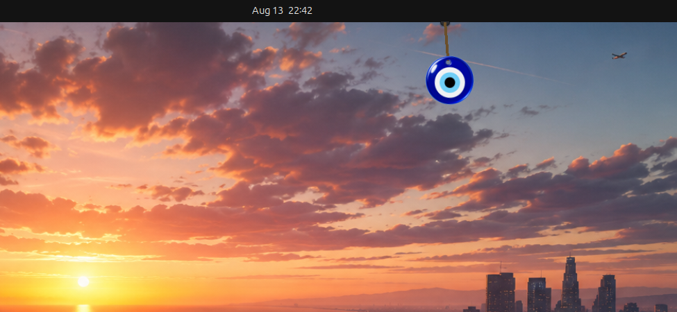

# SudoCharm

Root-level good luck for your desktop.



It hangs there over your desktop and sways. Grab it and it swings — the cord
stretches while you pull and whips when you let go, because it is an actual
pendulum rather than a looping animation. Call it down and it performs a small
ritual belonging to that particular charm.

It does nothing useful. That is the entire point.


| Charm | | Ritual |
| --- | --- | --- |
| Nazar boncuğu | Turkey | Flick it and it spins |
| Hamsa | Middle East & North Africa | The eye wakes |
| Nimbu-mirchi | India | The old lemon drops off, a fresh one rises |
| Daruma | Japan | Paint one eye for the wish, the other when it lands |
| Maneki-neko | Japan | Three beckons |
| Horseshoe | Europe | A flip and a bounce |
| Scarab | Egypt | The wing cases part |

Or any emoji you like, treated with the same reverence.

The daruma remembers. Call it down once to make a wish and it paints its left
eye; call it again when the wish lands and it paints the right. That state
survives reboots, which means the doll on your screen is keeping score.

## Installing

GNOME Shell 45 to 48. Wayland or X11. Linux only — there is no macOS or Windows
version and none planned.

Download the zip from [Releases](../../releases) and:

```sh
gnome-extensions install --force sudocharm@rahul.local.shell-extension.zip
gnome-extensions enable sudocharm@rahul.local
```

Or from source:

```sh
git clone https://github.com/rahulpatwa1303/SudoCharm
cd SudoCharm
./install.sh
```

Either way, **log out and back in**. GNOME Shell cannot load a new extension
into a running Wayland session — there is no way around this and it catches
everyone once.

## Using it

| | |
| --- | --- |
| Click the charm | It drops and performs its ritual |
| Drag it | It swings, and the cord stretches as you pull |
| Drag the hook, or Ctrl-drag the charm | Re-hang it anywhere along the top edge |
| Right-click it | Switch charms, read where each one comes from, turn off the breeze |
| `Super`+`Alt`+`L` | Call it down |
| `Super`+`Alt`+`K` | Take it down, or hang it back up |

Take it down and the bare hook stays under the top bar. Click the hook to hang
the charm up again.

Sizes, cord length, what it hangs by — a fine thread, a round leather cord, or
twisted rope — how strong the breeze is and how fast a flick rings down are all
in the preferences:

```sh
gnome-extensions prefs sudocharm@rahul.local
```

## From a script

Everything is on the session bus, so a shell script can reach it with no
dependencies:

```sh
sudocharm bless              # call it down
sudocharm flick 6            # just push it
sudocharm charm daruma       # switch charms
sudocharm toggle             # hang it up, or take it down
sudocharm count              # how many times it has been called down
```

Bless a commit:

```sh
# .git/hooks/post-commit
sudocharm bless "$(git rev-parse --short HEAD)"
```

Bless a green test run, and nudge it on a red one:

```sh
pytest && sudocharm bless || sudocharm flick 9
```

The `sudocharm` command is a thin wrapper over `gdbus`, so nothing needs
installing on the far end:

```sh
gdbus call --session --dest org.gnome.Shell \
  --object-path /org/gnome/shell/extensions/sudocharm \
  --method org.gnome.Shell.Extensions.SudoCharm.Bless "deploy"
```

## How it hangs

Three coupled systems are integrated every frame: the swing, the cord's
elasticity, and the charm's own lag behind the cord.

```
θ''       = −(g/L)·sin θ − damping·θ' + breeze(t)
stretch'' = −k·stretch − c·stretch' + ω²·L·0.06
lag''     = −k₂·(lag − θ) − c₂·lag'
```

`L` is the live cord length, so hauling the charm down genuinely slows its
period. Gravity is tuned by eye rather than taken from physics — real gravity at
screen scale swings far too slowly to read as a small object on a short string.
The breeze is three sine waves with periods of 6.7, 10.9 and 17.3 seconds, which
do not divide into one another, so the drift never visibly repeats.

The elastic cord is most of what separates a string from a rod. The charm hangs
*from* the cord rather than being welded to it, which is why a flick makes it
whip.

## Notes from building it

Things that were not obvious, in case they save someone else the afternoon.

**Only the charm takes clicks.** The artwork is a monitor-sized chrome layer
added with `affectsInputRegion: false` — drawn above every window, absent from
the compositor's input region. Two small tracked hit areas, the charm and its
hook, are the only rectangles on screen that take input. This is the whole
reason it is a shell extension rather than an ordinary app: on Wayland a normal
client cannot draw over other windows *and* be click-through.

**Dragging needs a pointer grab, and the grab moves where events arrive.** The
hit area is small, so a drag leaves it within a few pixels. Once the pointer is
over an ordinary window, its motion events go to that application rather than to
the shell, and a handler listening on the stage stops hearing anything at all —
the drag freezes while still believing it is a drag. Taking a
`global.stage.grab()` fixes the routing, but a Clutter grab delivers events to
the grab actor's subtree, so `captured-event` on the stage then stops firing
too. The handlers belong on the grabbed actor.

**Clutter's rotation runs the opposite way to intuition.** A child hanging below
the pivot moves *left* for a positive `rotation_angle_z`. Getting this backwards
mirrors every interaction, and it is not the kind of thing you notice by reading
the code.

**The grabbable area chases the charm, but only every 8 pixels.** Moving a
tracked actor makes the compositor recompute its input region, and the charm
never stops moving, so following it every frame would mean recomputing forever.

**Each charm hangs from a different point in its own artwork** — the nazar from
the hole drilled through its glass at 0.157, the nimbu from the very top of its
string at 0.02. That point is `hangPivot`, and two things have to agree on it:
the cord is drawn to exactly there, and the charm rotates about exactly there.
Get either wrong and the two come apart the moment it swings — the charm's lag
walks its hole sideways off the end of the cord, and the cord's tip pokes out
from behind the artwork. It looks fine at rest, which is what makes it easy to
ship.

**The cord is drawn in Cairo, not styled as a widget.** A rectangle only has
clean edges while it is upright. Rotated — which is to say, whenever anyone is
actually looking at it — the compositor gives it no antialiasing, and a 4px cord
with 1px light and dark side borders stair-steps into a dashed twig. Drawing it
by hand also buys the bow: a cord has weight, so its middle trails through the
fast part of a swing while both its ends stay pinned. That curve is most of what
separates a cord from a rod.

There is deliberately no scroll handler. The grabbable area is invisible and
sits over other windows, and swallowing scroll there would stop the page
underneath from scrolling.

## Working on it

Editing an extension normally costs a logout, because GJS keeps every imported
module for the life of the process and a plain disable/enable re-runs the *old*
code. A query string does not get around it; `import('./x.js?v=2')` returns the
cached module. A path GJS has never seen does.

So `extension.js` is a small stable loader, and in dev mode it copies the
implementation into a fresh directory on each enable:

```sh
touch DEV           # turn dev mode on
sudocharm-reload    # about a second, no logout
```

Delete `DEV` for a normal install and nothing is copied. It ships off, which
matters: an orphaned instance whose clock is still running will throw on every
frame, and a storm of exceptions inside the compositor's frame dispatch takes
the rest of the shell down with it.

`metadata.json` and the compiled schema are still read once at startup, so
changing those does need a logout.

Two things that cannot be checked by reading the code:

```sh
./shoot /tmp/out        # run it in a nested shell and photograph it
sudocharm-drag-check    # watch the drag maths while you drag
```

`shoot` catches what an error log never will — a cord that fails to reach the
charm, a charm pinned sideways at its swing limit. `drag-check` prints a
`motions=` counter alongside the angle, which is the difference between "events
are not arriving" and "the maths is wrong". Those two look identical from the
outside.

## Replacing the artwork

`ART-BRIEF.md` has the shot list. The short version: charms with a ritual have
to be drawn as separate pieces, because the lemon falls off and the wing cases
part. Drop PNGs into `art-drop/` and run `./import-art`; a PNG overrides the SVG
of the same name, so no code changes and deleting it falls back to the vector.

## The name

`sudo` grants superuser rights on a Unix system — the highest privilege there
is. This applies it to luck, which is not a thing you can actually be granted
privileges over. That is the joke and it does not need explaining twice.

## Credit

The idea comes from [Lucky Dangle](https://luckydangle.app/), a macOS menu bar
app, and is used here with admiration. This is an independent implementation for
GNOME: the code and the artwork are original and nothing was copied. If you are
on a Mac, buy theirs.

## Licence

GPL-3.0-or-later.
